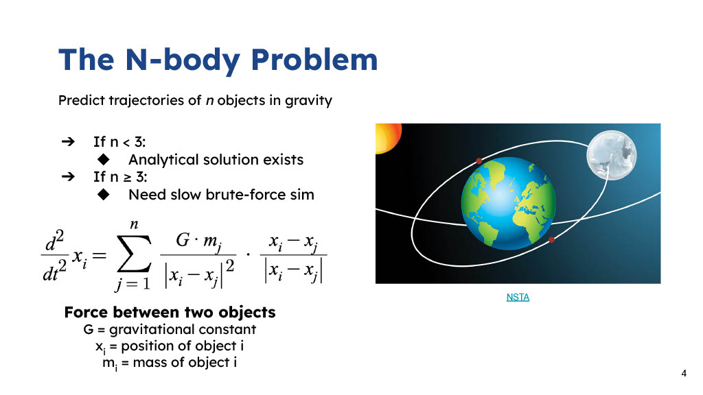
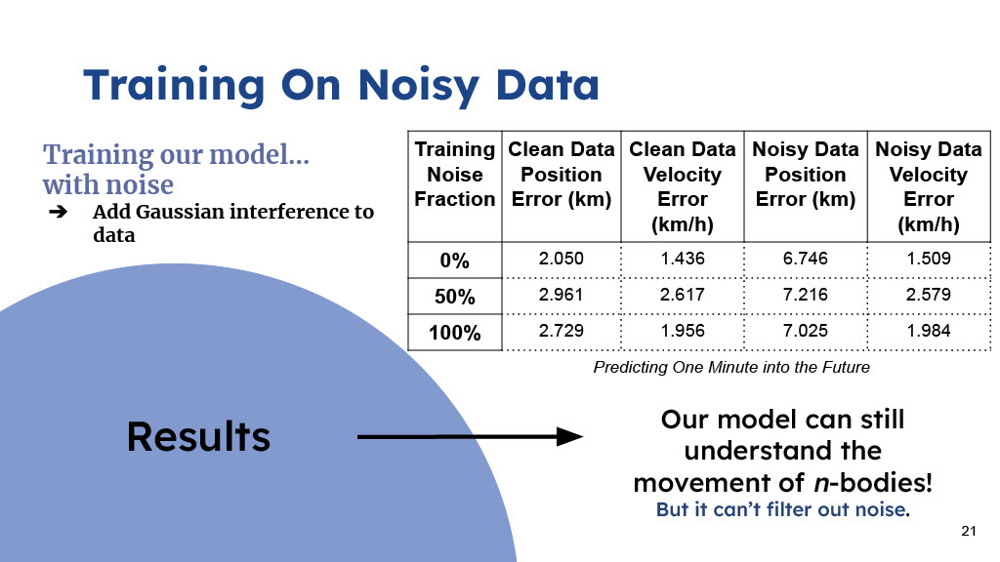

This was a group research program, done between 3 people I'll call LemonKat, Gabby, and A. S. 

Our project implements a noise-robust ML model to approximate the n-body problem in physics in order to predict satellite trajectories in low-earth orbit.

Quick and reliable predictions for satellite paths in orbit are crucial for the safety of the spacecraft and their occupants. Orbiting satellites are pulled on by the Earth, Moon, Sun, and other celestial bodies. This is an instance of the n-body problem, which describes the interaction of three or more objects but is impossible to solve analytically. 

Computational models generally approximate the motion of multiple bodies but have limitations such as long runtimes and inaccurate results. To replace these traditional models, data-driven machine learning (ML) approaches, known as surrogate models can be used. ML models are able to handle computational complexity far better than their traditional counterparts, providing a viable tool to analyze the n-body problem. 

While ML models are already in the works to predict the motion of an object under the gravity of multiple bodies, their accuracy when trained on or exposed to noisy input data is unknown. Our ML models predict satellite trajectories in low Earth orbit with high accuracy after learning from simulated data. When trained with noise to imitate real-world data, each model still accurately predicts spacecraft orbits under the gravitational pull of numerous bodies, but fails to filter out noise in input data.

Methods:

We used a standard computational model, using a runge-kutta solver to generate training data. We then trained a neural network to predict the position and velocity of a satellite a certain time interval after a given inital position and velocity.

We then t